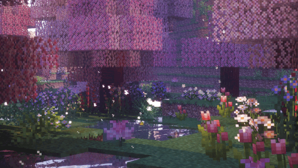

<div align="center">


<br/><br/>

[](https://git.io/typing-svg)

<br/>


</div>

---

### 🧠 Who am I?

Hi 👋 I'm **Aseel**, a fresh **AI Engineer** graduating with a B.Sc. in Artificial Intelligence from the **University of Jeddah** (GPA **4.94/5.00**).

- 🔬 I build end-to-end AI pipelines — from data preprocessing to model evaluation and deployment
- 🤖 My focus: **Machine Learning, Deep Learning, NLP, Computer Vision, Generative & Agentic AI, RAG, and Explainable AI**
- 📄 Published researcher — my work on Hadith-aligned story generation with fine-tuned LLMs appears in the **Arabian Journal for Science and Engineering (Springer Nature)**
- 🏆 **ITEX 2025 Gold Medalist** (Kuala Lumpur) for a real-time sound recognition & accessibility system
- 🇸🇦 Founder of **Synapse**, a nonprofit supervised by SDAIA
- 💡 Mindset: *learn deeply, build responsibly, and design AI that includes everyone*

<br/>

### 🔭 What I'm up to

```text
🧑‍🏫  Teaching Python, ML & Generative AI — AI Instructor, Ministry of Education × KAUST Academy
🌪️  Built AI models for early dust-storm detection — National Center for Meteorology
🕋   Co-developing an Arabic sign-language Quran recitation tool with Tafsir Center for Quranic Studies
📚  Growing Synapse, an SDAIA-supervised nonprofit I founded
🌱  Always exploring: agentic AI, explainable AI, and Arabic NLP
```

<br/>

### 🚀 Featured Work

<table>
<tr>
<td width="50%" valign="top">

**🥇 Real-Time Sound Recognition & Accessibility System**
*ITEX 2025 Gold Medal — Kuala Lumpur*
Real-time audio classification pipeline using FFT, mel-spectrograms, and a CNN (MobileNetV1/AudioSet) classifying **521 sound classes** for accessibility alerts.

</td>
<td width="50%" valign="top">

**📄 Hadith-Aligned Story Generation with Fine-Tuned LLMs**
*Published — Arabian Journal for Science and Engineering (Springer Nature)*
Fine-tuned ALLaM-7B, Qwen2.5-7B & Llama-3-8B with **QLoRA**, plus a BGE-M3 retrieval & reranking pipeline to generate authentic Arabic children's stories.

</td>
</tr>
<tr>
<td width="50%" valign="top">

**⚖️ Saudi Arabic Laws & Regulations Corpus**
*Published Dataset*
Article-level Arabic legal corpus scraped and normalized from the Bureau of Experts & Ministry of Justice using Playwright + BeautifulSoup, with cross-source deduplication.

</td>
<td width="50%" valign="top">

**🔍 Reducing Hallucinations in Arabic Legal LLMs**
*RAG + Explainable AI*
Hybrid Dynamic RAG-XAI pipeline (BM25, BGE-M3, FAISS, RRF, bge-reranker) with claim-level verification, benchmarked using DeepEval.

</td>
</tr>
</table>

<details>
<summary>✋ <b>Sign to Revise</b> — Arabic fingerspelling recognition (with Tafsir Center for Quranic Studies)</summary>
<br/>
A computer-vision model that detects hand gestures and maps them to Arabic letters, tested with deaf users and the Saudi Association for Hearing Impairment (SHI) to improve accessibility and learning independence.
</details>

<br/>

### 🏅 Awards & Recognition

| Competition | Result | Organizer |
|:--|:--:|:--|
| Real-Time Sound Recognition & Accessibility | 🥇 Gold Medal | ITEX 2025, Kuala Lumpur |
| AudioAid | 🥈 2nd / 80+ teams | AthkaU · SDAIA & Microsoft |
| جمهورك \| Your Audience | 🥇 1st / 1,500+ applicants | Ministry of Culture & Film Commission |
| تَلا \| Talaa | 🥇 1st Place | Emirate of Makkah Region & Univ. of Jeddah |
| PolicyThon | 🏅 Top 15 / 4,500+ | Ministry of Culture |
| مِداد \| Medad | 🥉 3rd / 36 projects | CampusThon, King Abdulaziz University |
| طيب \| Teeb | 🥈 2nd Place | Hajj Logistics Hackathon |

<br/>

### 🛠️ Tech Stack

<div align="center">


<br/><br/>


</div>

<br/>

### 📊 GitHub Stats

<div align="center">


</div>

<br/>

### 🌟 Soft Skills

`Leadership` · `Problem Solving` · `Strategic & Critical Thinking` · `Innovation` · `Time Management` · `Public Speaking` · `Communication` · `Teamwork`

<br/>

### 🤝 Let's Connect

<div align="center">

[](mailto:AseelAlmehmadii@gmail.com)
[](https://linkedin.com/in/aseel-almehmadi-302770209)
[](https://aseeliscoding.github.io/Profolio./)
[](https://github.com/AseelIsCoding)

</div>

<br/>

<div align="center">


<br/><br/>

<i>"Learn deeply. Build responsibly. Design AI that includes everyone."</i>


</div>
